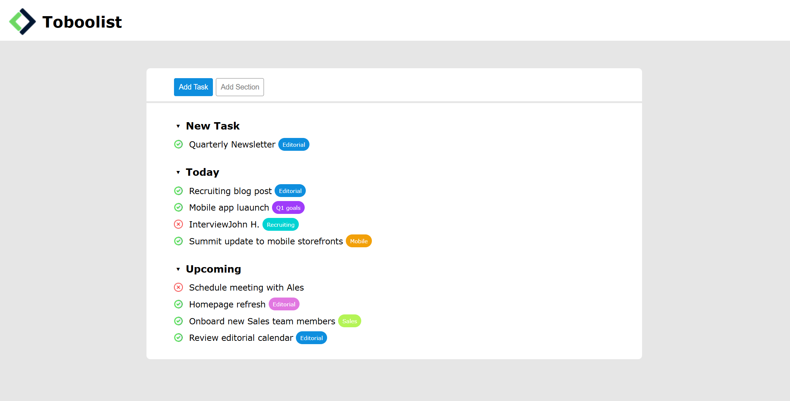

<h1 align="center">Toboolist</h1>

  Esercizio svolto durante il corso Boolean per esercitarmi con la creazione di un layout HTML/CSS ispirato a una Todo List.

## Obiettivo

- Ricreare il layout fornito della Todo List (“Toboolist”) usando HTML e CSS.
- Individuare le macroaree del layout (header, contenuto principale, liste di task, ecc.).
- Analizzare gli elementi in comune tra le varie sezioni e centralizzare il più possibile le regole CSS, per rendere il codice meno ripetitivo e più mantenibile.

## Anteprima

## Tecnologie utilizzate

- HTML
- CSS